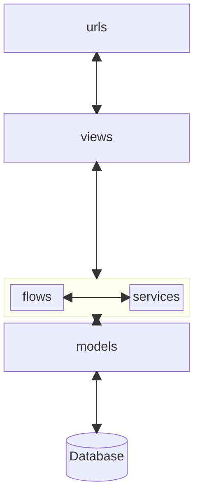

# Pet project to test Viewflow framework

[View-flow framework](https://docs.viewflow.io/overview/index.html)

## Project description

Let's imagine the IT company Software+. A lot of great developers work here.
And it's important to make the process of grade improvement as easy as possible.

This project "icrm" should help the company with this issue.

## Functional requirements

### Admin
- [x] Add new delivery manager.
- [x] Add new developer.
- [x] Add new customer.

### Customer
- [x] Can see all his developers.
- [x] Can request a new developer with a specific skills.
- [x] Can see the history of previous developer requests.
- [ ]  Can see all "grade improvement" processes initiated by my developers and have already being approved by the delivery manager.
- [ ]  Can approve or reject a "grade improvement" process initiated by my developer.

### Delivery manager
- [x] Can suggest developers for customer request.
- [ ]  Can see all started "grade improvement" processes by his developers.
- [ ]  Can approve or reject a "grade improvement" process is started by his developer.

### Developer
- [ ] Can start a "grade improvement" process (only one started process can be at a time).
- [ ] Can see all initiated processes by himself (with current status).

## Base architecture

