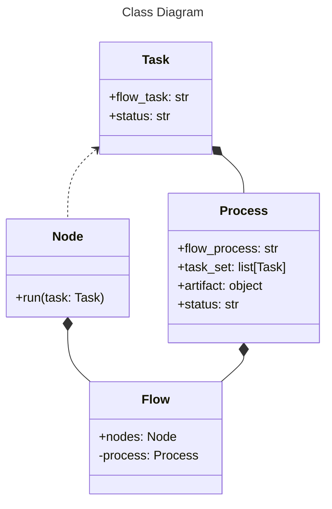
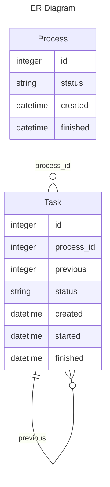

# Business flows

It is used when few tasks are interconnected, and it is necessary to control their dependencies flexibly.

Oftentimes it is related when several users are involved in a business process.

`Client` should not call Tasks and Processes directly.
Instead of it the API should be implemented in the `node_runner.py` module.

### API

### DB representation

`Process` entity saves the state of entire business process.

`Task` entity saves the state of separated tasks.

